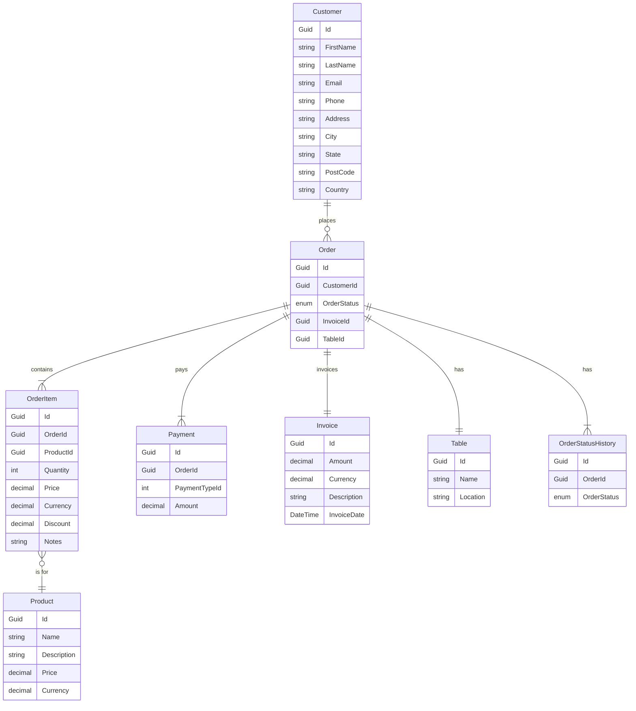
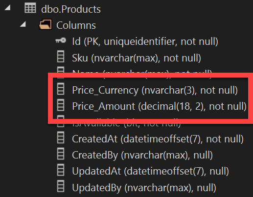
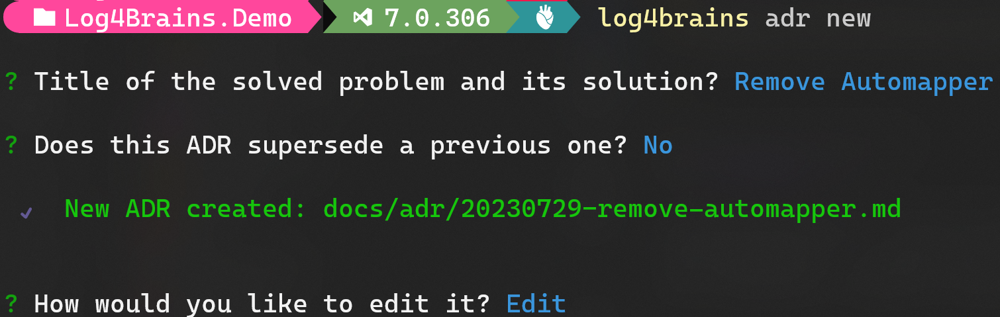

# Cafe365

## Contents

- [Cafe365](#cafe365)
  - [Contents](#contents)
  - [Introduction](#introduction)
  - [Prerequisites](#prerequisites)
  - [Template Setup](#template-setup)
  - [Template Walkthrough](#template-walkthrough)
  - [Domain Layer](#domain-layer)
    - [Domain Entities](#domain-entities)
    - [Persistence](#persistence)
    - [Strongly Typed IDs](#strongly-typed-ids)
    - [Owned Entities](#owned-entities)
  - [Infrastructure Layer](#infrastructure-layer)
    - [Test Data](#test-data)
  - [Application \& Presentation Layers](#application--presentation-layers)
    - [DbContext](#dbcontext)
    - [Get Order Details Query](#get-order-details-query)
    - [.HTTP Files](#http-files)
    - [Submit Order Command](#submit-order-command)
  - [Domain Events](#domain-events)
    - [Create the Order Submitted Event](#create-the-order-submitted-event)
  - [Domain Driven Design](#domain-driven-design)
    - [DDD Setup](#ddd-setup)
    - [Refactor `SubmitOrderCommand` to use DDD](#refactor-submitordercommand-to-use-ddd)
  - [Specifications](#specifications)
    - [Refactor SubmitOrder Command to use Specifications](#refactor-submitorder-command-to-use-specifications)
  - [Trade-Offs](#trade-offs)
    - [ADRs](#adrs)
  - [Finished! 🎉](#finished-)

## Introduction

Since the COVID-19 pandemic, we've had a plethora of e-commerce systems built that allow customers to order directly from their restaurant table and have it delivered without having to leave.

In this workshop, we are going to build an API for a similar application called `Cafe365`. We will build out this e-commerce application using the Clean Architecture principles.

## Prerequisites

- Docker Desktop (or Podman)
- SQL Server (Local or Docker)
- WSL2 (Windows only)
- .NET 7
- Visual Studio 2022 (or VS Code / Rider)

## Template Setup

1. Install the SSW CA template

```bash
dotnet new install SSW.CleanArchitecture.Template
```

> **Note**
> The template only needs to be installed once. Running this command again will update your version of the template.

2. Create a new directory

```bash
mkdir Cafe365.{Location}
cd Cafe365.{Location}
```

3. Create a new solution

```bash
dotnet new ssw-ca
```

4. Rename solution

```bash
mv .\CleanArchitecture.sln .\Cafe365.{Location}.sln
```

> **Note**
> This will use the Directory name as the Solution name and project namespaces.

## Template Walkthrough

- Domain Layer
  - Entities
    - Strongly Typed IDs
  - Enum
  - Events
- Application Layer
  - Mediator
    - Commands
      - Validation
    - Queries
    - Pipelines
      - Logging
      - Performance
      - Validation
      - Exception Handling
    - ViewModels / DTOs
    - Application Exceptions
  - DependencyInjection
- Infrastructure Layer
  - External services
  - Persistence
    - Configuration
    - Interceptors
      - EntityAuditing
      - EventDispatching
    - Migrations
  - Services
  - DependencyInjection
    - DB Retries
- WebApi Layer
  - Database Initialization
  - Minimal APIs
    - Grouping
    - Consistent Responses
  - Mapping of exceptions to HTTP responses
  - Configuration
  - OpenAPI
    - Swagger
    - API Client Generation
- EditorConfig
  - Styling / Formatting
  - Code Analysis

> **Note**
> Tests will be covered in a later part of the workshop

## Domain Layer

First, let's inspect the existing `Domain` layer.

Now we need to build up our `Domain` for Cafe365.



### Domain Entities

1. Create feature folders for `Customers`, `Orders`, and `Products`.

2. Create the `Customer`, `Order`, `OrderItem`, and `Product` entities under the relevant feature folders.

```csharp
public class Customer
{
    public string FirstName { get; set; } = null!;
    public string LastName { get; set; } = null!;
    public string Email { get; set; } = null!;
    public string Phone { get; set; } = null!;
    public string Address { get; set; } = null!;
    public string City { get; set; } = null!;
    public string State { get; set; } = null!;
    public string PostCode { get; set; } = null!;
    public string Country { get; set; } = null!;

    public ICollection<Order> Orders { get; set; } = new List<Order>();
}
```

```csharp
public class Order
{
    public required Guid CustomerId { get; set; }
    public OrderStatus OrderStatus { get; set; }
    public decimal PaidTotal { get;set; }

    public Customer? Customer { get; set; }
    public ICollection<OrderItem> Items { get; set; } = new List<OrderItem>();
}
```

```csharp
public class OrderItem
{
    public Guid OrderId { get; set; }
    public Guid ProductId { get; set; }
    public int Quantity { get; set; }
    public decimal Price { get; set; }

    public Order Order { get; set; }
    public Product Product { get; set; }
}
```

```csharp
public class Product
{
    public string Sku { get; set; } = null!;
    public string Name { get; set; } = null!;
    public decimal Price { get; set; }
    public string Currency { get; set; } = null!;
    public int AvailableStock { get; set; }
    public bool IsStockedItem { get; set; }
}
```

3. Create the `OrderStatus` enum under `Domain\Orders`

```csharp
public enum OrderStatus
{
    New,
    InProgress,
    Complete,
    Cancelled
}
```

4. Ensure all entities inherit from `BaseEntity<Guid>`

5. Build.

### Persistence

1. Add Entities to our DbContext `Infrastructure\Persistence\ApplicationDbContext.cs`

```csharp
public DbSet<Customer> Customers => Set<Customer>();

public DbSet<Order> Orders => Set<Order>();

public DbSet<OrderItem> OrderItems => Set<OrderItem>();

public DbSet<Product> Products => Set<Product>();
```

2. Update `Infrastructure\Persistence\ApplicationDbContextInitializer.cs` so that we re-create the database each time the application starts.

> **Note**
> This is fine in early stages of development, but prior to a production release, we would want to remove this code and use migrations instead.

```csharp
//await _dbContext.Database.MigrateAsync();
await _dbContext.Database.EnsureDeletedAsync();
await _dbContext.Database.EnsureCreatedAsync();
```

3. Update the connection string in user secrets by selecting `WebApi` | `Manage User Secrets`.

```json
{
  "ConnectionStrings": {
    "DefaultConnection": "Server=(localdb)\\MSSQLLocalDB;Database=Cafe365.{Location};Trusted_Connection=True;MultipleActiveResultSets=true;TrustServerCertificate=True"
  }
}
```

> **Note**
> Alternatively, you can use spin up a DB using Docker.

Run Docker compose:

```bash
cd .\src
docker compose up
```

Update user secrets as follows:

```json
{
  "ConnectionStrings": {
    "DefaultConnection": "Server=localhost,1433;Initial Catalog=Cafe365.{Location};Persist Security Info=False;User ID=sa;Password=yourStrong(!)Password;MultipleActiveResultSets=True;TrustServerCertificate=True;Connection Timeout=30;"
  }
}
```

4. Update `{Location}`

5. Run the `WebApi` project and ensure that the database is created with the following tables:

- `Customers`
- `Orders`
- `OrderItems`
- `Products`

### Strongly Typed IDs

Now we have a handful of entities and tables created in the database. However, you might notice we are using `Guid` as the primary key for all entities. This is not ideal as there is nothing stopping us from passing around a CustomerId when we really need an OrderId. We can protect our code by creating strongly typed IDs for each entity.

1. Navigate to `Domain\Customers\Customer.cs` and add the following code:

```csharp
public record CustomerId(Guid Value);
```

2. Update the class definition:

```csharp
public class Customer : BaseEntity<CustomerId>
```

3. Run the solution and check that that our persistence layer is still working.

4. BOOM! 💥 We will now have the following exception:

```bash
System.InvalidOperationException
  Message=The entity type 'Customer' requires a primary key to be defined. If you intended to use a keyless entity type, call 'HasNoKey' in 'OnModelCreating'. For more information on keyless entity types, see https://go.microsoft.com/fwlink/?linkid=2141943.
```

This is because EF Core doesn't know how to map from our DB column to our new `CustomerId` type. We can fix this by adding a converter.

5. Add a new file to `Infrastructure\Persistence\Configuration\CustomerConfiguration.cs`

```csharp
public class CustomerConfiguration : IEntityTypeConfiguration<Customer>
{
    public void Configure(EntityTypeBuilder<Customer> builder)
    {
        builder.HasKey(t => t.Id);
        builder.Property(t => t.Id)
            .HasConversion(x => x.Value,
                x => new CustomerId(x))
            .ValueGeneratedOnAdd();
    }
}
```

6. Check that the solution is working again.

7. Add the remaining strongly typed IDs:

```csharp
public record OrderId(Guid Value);
```

```csharp
public record OrderItemId(Guid Value);
```

```csharp
public record ProductId(Guid Value);
```

8. Ensure Foreign Keys are using strongly typed IDs for `Order`, `OrderItem`.


9. Add the following configuration classes for `Order`, `OrderItem`, and `Product`.

```csharp
public class OrderConfiguration : IEntityTypeConfiguration<Order>
{
    public void Configure(EntityTypeBuilder<Order> builder)
    {
        builder.HasKey(t => t.Id);
        builder.Property(t => t.Id)
            .HasConversion(x => x.Value,
                x => new OrderId(x))
            .ValueGeneratedOnAdd();
    }
}

public class OrderItemConfiguration : IEntityTypeConfiguration<OrderItem>
{
    public void Configure(EntityTypeBuilder<OrderItem> builder)
    {
        builder.HasKey(t => t.Id);
        builder.Property(t => t.Id)
            .HasConversion(x => x.Value,
                x => new OrderItemId(x))
            .ValueGeneratedOnAdd();
    }
}

public class ProductConfiguration : IEntityTypeConfiguration<Product>
{
    public void Configure(EntityTypeBuilder<Product> builder)
    {
        builder.HasKey(t => t.Id);
        builder.Property(t => t.Id)
            .HasConversion(x => x.Value,
                x => new ProductId(x))
            .ValueGeneratedOnAdd();
    }
}
```

10.  Run to check that the solution is still working.

11.  BOOM! 💥 We will now have the following exception:

```bash
System.InvalidOperationException
  Message=The entity type 'CustomerId' requires a primary key to be defined. If you intended to use a keyless entity type, call 'HasNoKey' in 'OnModelCreating'. For more information on keyless entity types, see https://go.microsoft.com/fwlink/?linkid=2141943.
```

This is a bit cryptic, but basically, EF no longer knows how to map FK relationships for our strongly typed IDs.

12. Add the following to `Infrastructure\Persistence\Configuration\OrderConfiguration.cs`

```csharp
builder.HasOne(t => t.Customer)
    .WithMany(t => t.Orders)
    .HasForeignKey(t => t.CustomerId)
    .IsRequired();
```

13. Add additional EF Configuration for `OrderItem`

```csharp
builder.HasOne(t => t.Order)
    .WithMany(t => t.Items)
    .HasForeignKey(t => t.OrderId)
    .IsRequired();

builder.HasOne(t => t.Product)
    .WithMany()
    .HasForeignKey(t => t.ProductId)
    .IsRequired();
```

14. Build and run

15. Inspect DB to ensure schema looks correct

### Owned Entities

When designing our schema, the models often become **property bags** that map 1-1 with the database. However, that doesn't always have to be the case. Even though our DB table will still be a list of fields, our model doesn't have to be. By **structuring our models** in a way that makes sense to our domain, we can make our code **easier to understand and maintain**.

We can configure this in EF Core using Owned Entities.

1. Create the `Money` entity in `Domain\Common\ValueObjects\Money.cs`

```csharp
public record Money(string Currency, decimal Amount);
```

2. Refactor `OrderItem` to use `Money`

```csharp
public class OrderItem : BaseEntity<OrderItemId>
{
    public OrderId OrderId { get; set; }
    public ProductId ProductId { get; set; }
    public int Quantity { get; set; }

    // public decimal Price { get; set; } 👈 code removed
    public Money Price { get; set; } = null!; // 👈 code added

    public Order Order { get; set; }
    public Product Product { get; set; }
}

```

3. Configure EF to know what column types to use for `Money`. Create a new file called `MoneyConfiguraiton.cs`

```csharp
internal static class MoneyConfiguration
{
    internal static void BuildAction<T>(OwnedNavigationBuilder<T, Money> priceBuilder) where T : class
    {
        priceBuilder.Property(m => m.Currency).HasMaxLength(3);
        priceBuilder.Property(m => m.Amount).HasPrecision(18, 2);
    }
}
```

> **Note**
> This is a configuration helper so that all instances of `Money` are configured the same way in the DB.

4. Tell EF to use `Money` for `OrderItem`. Add the following to `OrderItemConfiguration`

```csharp
builder.OwnsOne(t => t.Price, MoneyConfiguration.BuildAction);
```

5. Refactor `Order` to use `Money` for `PaidTotal`

```csharp

public class Order : BaseEntity<OrderId>
{
    public required CustomerId CustomerId { get; set; }
    public OrderStatus OrderStatus { get; set; }
    public Money PaidTotal { get; set; } // 👈 code updated

    public Customer? Customer { get; set; }
    public ICollection<OrderItem> Items { get; set; } = new List<OrderItem>();
}
```

6. Tell EF to use `Money` for `Order`. Add the following to `OrderConfiguration`

```csharp
builder.OwnsOne(t => t.PaidTotal, MoneyConfiguration.BuildAction);
```

5. Refactor `Product` to use `Money`

```csharp

public class Product : BaseEntity<ProductId>
{
    public string Sku { get; set; } = null!;
    public string Name { get; set; } = null!;

    // 👇 code removed
    // public decimal Price { get; set; }
    // public string Currency { get; set; } = null!;
    // 👆 code removed

    public Money Price { get; set; } = null!; // 👈 code added

    public int AvailableStock { get; set; }
    public bool IsStockedItem { get; set; }
}
```

6. Tell EF to use `Money` for `Product`. Add the following to `ProductConfiguration`

```csharp
builder.OwnsOne(t => t.Price, MoneyConfiguration.BuildAction);
```


1. Build and run the solution. Check that our persistence layer is still working.

2. Check `Product` table to see that the schema has slightly changed for our owned entities:



> **Warning**
> Slide 03 - Exercise (Domain Layer)

## Infrastructure Layer

### Test Data

We've already done some configuration in our `Infrastructure` layer, but there is one more thing we need to do. When setting up a **local environment** we can save lots of time for other developers by having some **test data** already in the database. This will allow us to test our API without having to manually create data in the database. Let's setup that up now.

1. In our terminal navigation to `\src\Infrastructure\`

2. Install `Bogus`

```bash
dotnet add package Bogus
```

3. Navigate to `ApplicationDbContextInitializer`

4. Remove all the `Todo` related code

5. Configure the amount of test data you want to generate in `ApplicationDbContextInitializer`

```csharp
private const int NumProducts = 20;
```

6. Replace the `SeedAsync` method with the following:

```csharp
public async Task SeedAsync()
{
    await SeedProductsAsync();
}
```

7. Seed `Product` data:

```csharp
private async Task SeedProductsAsync()
{
    if (await _dbContext.Products.AnyAsync())
        return;

    var moneyFaker = new Faker<Money>()
        .CustomInstantiator(f => new Money(f.Finance.Currency().Code, f.Finance.Amount()));

    var faker = new Faker<Product>()
        .CustomInstantiator(f => new Product
        {
            Name = f.Commerce.ProductName(),
            Price = moneyFaker.Generate(),
            Currency = f.Finance.Currency().Code,
            Sku = f.Commerce.Ean13(),
            AvailableStock = f.Random.Int(0, 10),
            IsStockedItem = f.Random.Bool()
        });

    var products = faker.Generate(NumProducts);
    _dbContext.Products.AddRange(products);
    await _dbContext.SaveChangesAsync();
}
```

8. Run the solution and check we now have `Product` table populated in the DB.

> **Note**
> This gives us a basic, but useful way to seed test data. We can easily pump up the numbers to generate a large amount of data. However, in a real world application you'll want to split your data between test data and static data.
>
> Test data would only be generated in non-production environments, where static data would be generated everywhere.

> **Warning**
> Get the attendees to do the rest, but carry on before pushing the code

9. Configure the number of `Customer`, `Order`, and `OrderItem` entities we want to create

```csharp
private const int NumCustomers = 20;
private const int NumOrders = 20;
private const int NumOrderItems = 5;
```

10. Seed `Order` data:

```csharp
    private async Task SeedOrdersAsync()
    {
        if (await _dbContext.Orders.AnyAsync())
            return;

        var customerIds = await _dbContext.Customers.Select(c => c.Id).ToListAsync();

        var productIds = await _dbContext.Products.Select(p => p.Id).ToListAsync();

        var moneyFaker = new Faker<Money>()
            .CustomInstantiator(f => new Money(f.Finance.Currency().Code, f.Finance.Amount()));

        var orderItemFaker = new Faker<OrderItem>()
            .CustomInstantiator(f => new OrderItem
            {
                Price = moneyFaker.Generate(),
                Quantity = f.Random.Int(0, 5),
                ProductId = f.PickRandom(productIds)
            });

        var orderFaker = new Faker<Order>()
            .CustomInstantiator(f => new Order
            {
                CustomerId = f.PickRandom(customerIds),
                OrderStatus = f.PickRandom<OrderStatus>(),
                PaidTotal = new Money("AUD", 0),
                Items = orderItemFaker.Generate(NumOrderItems),
            });

        var orders = orderFaker.Generate(NumOrders);
        _dbContext.Orders.AddRange(orders);
        await _dbContext.SaveChangesAsync();
    }
```

11. Seed `Customer` data:

```csharp
private async Task SeedCustomersAsync()
{
    if (await _dbContext.Customers.AnyAsync())
        return;

    var customerFaker = new Faker<Customer>()
        .CustomInstantiator(f => new Customer
        {
            FirstName = f.Person.FirstName,
            LastName = f.Person.LastName,
            Email = f.Person.Email,
            Phone = f.Person.Phone,
            Address = f.Address.StreetAddress(),
            City = f.Address.City(),
            State = f.Address.State(),
            Country = f.Address.Country(),
            PostCode = f.Address.ZipCode()
        });

    var customers = customerFaker.Generate(NumCustomers);
    _dbContext.Customers.AddRange(customers);
    await _dbContext.SaveChangesAsync();
}
```

12. Add these new seed functions to `SeedAsync()`.

13. Run the solution and check all tables are now populated as expected in the DB

> **Warning**
> Slide 03 - Exercise (Infrastructure Layer)

## Application & Presentation Layers

The next layer out from the `Domain` Layer is the `Application` Layer. This is where our application logic will go (for now). The application is responsible for **orchestrating** between the domain layer and the infrastructure layer. It is also responsible for mapping between the domain layer and the presentation layer.

The `Presentation` Layer is where our API will live. This is where we will expose our application to the outside world.

For the rest of the workshop, we'll adopt a **feature-based** approach where we build out the `Application` and `Presentation` layer together so that we can test our code as we go.

### DbContext

1. Add `Customer`, `Order`, `OrderItem` and `Product` to our `IApplicationDbContext` In `Application\Common\Interfaces`:

```csharp
public interface IApplicationDbContext
{
    DbSet<Customer> Customers { get; }

    DbSet<Order> Orders { get; }

    DbSet<OrderItem> OrderItems { get; }

    DbSet<Product> Products { get; }
}
```

### Get Order Details Query

1. Navigate to the `Application\Features` folder:

```bash
mkdir Orders
cd Orders
```

2. Create our `GetOrderQuery`

```bash
dotnet new ssw-ca-query --name GetOrder --entityName Order --namespaceRoot Cafe365.{Location}
```

3. Update our `GetOrderQuery` request:

```csharp
public record GetOrderQuery(Guid OrderId) : IRequest<OrderDto>;
```

4. Create our DTOs

```csharp
public class OrderDto
{
    public required Guid OrderId { get; init; }
    public required string OrderStatus { get; init; }
    public required CustomerDto Customer { get; init; }
    public required List<OrderItemDto> Items { get; init; }
}

public class CustomerDto
{
    public required Guid CustomerId { get; init; }
    public required string FirstName { get; init; }
    public required string LastName { get; init; }
}

public class OrderItemDto
{
    public required Guid OrderItemId { get; init; }
    public required int Quantity { get; init; }
    public required string Currency { get; init; }
    public required decimal Price { get; init; }
    public required ProductDto Product { get; init; }
}

public class ProductDto
{
    public required Guid ProductId { get; init; }
    public required string Sku { get; init; }
    public required string Name { get; init; }
}
```

5. Update the `GetOrderMapping` mapper

```csharp
public class GetOrderMapping : Profile
{
    public GetOrderMapping()
    {
        CreateMap<Order, OrderDto>()
            .ForMember(d => d.OrderId, opt => opt.MapFrom(s => s.Id.Value));

        CreateMap<Customer, CustomerDto>()
            .ForMember(d => d.CustomerId, opt => opt.MapFrom(s => s.Id.Value));

        CreateMap<OrderItem, OrderItemDto>()
            .ForMember(d => d.OrderItemId, opt => opt.MapFrom(s => s.Id.Value))
            .ForMember(d => d.Price, opt => opt.MapFrom(s => s.Price.Amount))
            .ForMember(d => d.Currency, opt => opt.MapFrom(s => s.Price.Currency));

        CreateMap<Product, ProductDto>()
            .ForMember(d => d.ProductId, opt => opt.MapFrom(s => s.Id.Value));
    }
}
```

6. Create the Handler

```csharp
public class GetOrderQueryHandler : IRequestHandler<GetOrderQuery, OrderDto> // 👈 updated code
{
    private readonly IApplicationDbContext _dbContext;
    private readonly IMapper _mapper;

    public GetOrderQueryHandler(IApplicationDbContext dbContext, IMapper mapper)
    {
        _dbContext = dbContext;
        _mapper = mapper;
    }

    // 👇 updated code
    public async Task<OrderDto> Handle(GetOrderQuery request, CancellationToken cancellationToken)
    {
        var orderId = new OrderId(request.OrderId);

        var order = await _dbContext.Orders
            .Where(o => o.Id == orderId)
            .ProjectTo<OrderDto>(_mapper.ConfigurationProvider)
            .FirstOrDefaultAsync(cancellationToken: cancellationToken);

        return order ?? throw new NotFoundException(nameof(Order), request.OrderId);
    }
    // 👆 updated code
}
```

7. In `WebApi` create under `Features` called `OrderEndpoints.cs`

```csharp
public static class OrderEndpoints
{
    public static void MapOrderEndpoints(this WebApplication app)
    {
        var group = app
            .MapGroup("orders")
            .WithTags("Orders")
            .WithOpenApi();

        group
            .MapGet("/{orderId:guid}", (Guid orderId, ISender sender, CancellationToken ct) => sender.Send(new GetOrderQuery(orderId), ct))
            .WithName("GetOrder")
            .ProducesGet<Application.Features.Orders.Queries.GetOrder.OrderDto>();
    }
}
```

8. Build and run

### .HTTP Files

When testing REST APIs we can use Swagger UI, Postman, or any other HTTP client. However, we can also use `.http` files to test our API. These files are supported by VS Code and VS 2019.

`.http` files are a simple yet effective way to make API calls and allow you to use variables to make testing easier.

1. Navigate to View | Other Windows | Endpoint Explorer.

2. Right-click on the `GetOrder` endpoint and select `Generate Request`

3. In the file that was just generated add the following:

```http
@orderId = 5e0240d7-5cbc-423f-81b9-1edd64172587

### Get Order Details

GET {{WebApi_HostAddress}}/orders/{{orderId}}
```

4. Hit the endpoint, and confirm data was successfully returned

> **Note**
> Endpoints Explorer is only available in VS 2022 17.6 Preview 6+.  You can enable it via Tools | Options | Preview Features | Web API Endpoints Explorer.  For more information see [here](https://learn.microsoft.com/en-us/aspnet/core/test/http-files?view=aspnetcore-8.0).

### Submit Order Command

1. Navigate to the 'Orders' folder:

```bash
cd Orders
```

2. Create the `SubmitOrder` command:

```bash
dotnet new ssw-ca-command --name SubmitOrder --entityName Order --namespaceRoot Cafe365.{Location}
```  

3. Update the `SubmitOrderCommand` request:

```csharp
public record SubmitOrderCommand(Payment Payment) : IRequest<Guid>
{
    [JsonIgnore]
    public Guid OrderId { get; set; }
}
```

> **Note**
> We'll add `Payment` soon

4. Update the handler:

```csharp

// 👇 updated code
public class SubmitOrderCommandHandler : IRequestHandler<SubmitOrderCommand, Guid>
{
    private readonly IApplicationDbContext _dbContext;

    private readonly IPaymentProvider _paymentProvider;
    private readonly IEmailProvider _emailProvider;

    public SubmitOrderCommandHandler(IApplicationDbContext dbContext, IPaymentProvider paymentProvider, IEmailProvider emailProvider)
    {
        _dbContext = dbContext;
        _paymentProvider = paymentProvider;
        _emailProvider = emailProvider;
    }

    public async Task<Guid> Handle(SubmitOrderCommand request, CancellationToken cancellationToken)
    {
        var orderId = new OrderId(request.OrderId);

        var order = await _dbContext.Orders
            .Include(o => o.Items)
            .FirstAsync(o => o.Id == orderId);

        var customer = _dbContext.Customers.FirstOrDefault(c => c.Id == order.CustomerId);
        if (customer == null)
            throw new ValidationException("Could not find customer");

        await ProcessPayment(request, order);
        await AdjustStock(order, cancellationToken);

        order.OrderStatus = OrderStatus.Complete;

        await _dbContext.SaveChangesAsync(cancellationToken);

        // Send confirmation email
        await _emailProvider.SendConfirmationEmail(customer.Email, customer.FirstName, order);

        return order.Id.Value;
    }

    private async Task ProcessPayment(SubmitOrderCommand request, Order order)
    {
        if (order.Items == null || !order.Items.Any())
            throw new ValidationException("Cant submit an order without any items");

        if (order.OrderStatus is OrderStatus.Complete or OrderStatus.Cancelled)
            throw new ValidationException("Order status is invalid");

        if (order.PaidTotal.Amount == 0)
            order.PaidTotal = new Money(request.Payment.Currency, request.Payment.Amount);
        else
            order.PaidTotal = new Money(request.Payment.Currency, request.Payment.Amount + order.PaidTotal.Amount);

        if (order.PaidTotal.Amount >= order.PaidTotal.Amount)
            order.OrderStatus = OrderStatus.Complete;

        var orderTotal = order.Items.Sum(i => i.Price.Amount * i.Quantity);
        var paymentResult = await _paymentProvider.ProcessPayment(request.Payment);
        if (!paymentResult.IsSuccessful)
            throw new PaymentFailedException("Payment was not successful");
    }

    private async Task AdjustStock(Order order, CancellationToken cancellationToken)
    {
        var productIds = order.Items.Select(i => i.ProductId).ToList();
        var products = await _dbContext.Products.Where(p => productIds.Contains(p.Id)).ToListAsync(cancellationToken);

        foreach (var item in order.Items)
        {
            var product = products.FirstOrDefault(p => p.Id == item.ProductId) ?? throw new ValidationException("Invalid Product");
            product.AvailableStock -= item.Quantity;

            if (product.IsStockedItem && product.AvailableStock < 0)
                throw new InvalidOperationException("Not enough stock submit the order");
        }
    }
}
// 👆 updated code
```

5. Update `ValidationException` to add a new constructor

```csharp
public ValidationException(string message)
: base(message)
{
    Errors = new Dictionary<string, string[]>
    {
        { "", new[] { message } }
    };
}
```

6. Add New Exception `PaymentFailedException`

```csharp
public class PaymentFailedException : Exception
{
    public PaymentFailedException()
        : base()
    {
    }

    public PaymentFailedException(string message)
        : base(message)
    {
    }

    public PaymentFailedException(string message, Exception innerException)
        : base(message, innerException)
    {
    }
}
```

7. Add new exception mappings to `ExceptionFilter`

```csharp
private static readonly IDictionary<Type, Func<HttpContext, Exception, IResult>> ExceptionHandlers = new Dictionary<Type, Func<HttpContext, Exception, IResult>>
{
    { typeof(ValidationException), HandleValidationException },
    { typeof(NotFoundException), HandleNotFoundException },
    // 👇 updated code
    { typeof(PaymentFailedException), HandlePaymentFailedException },
    { typeof(InvalidOperationException), HandleInvalidOperationException }
    // 👆 updated code
};

// 👇 updated code
private static IResult HandlePaymentFailedException(this HttpContext context, Exception exception) =>
Results.Problem(statusCode: StatusCodes.Status402PaymentRequired,
    title: "Payment Required",
    type: "https://tools.ietf.org/html/rfc7231#section-6.5.4",
    detail: exception.Message);

private static IResult HandleInvalidOperationException(this HttpContext context, Exception exception) =>
    Results.Problem(statusCode: StatusCodes.Status409Conflict,
        title: "Conflict",
        type: "https://tools.ietf.org/html/rfc7231#section-6.5.4",
        detail: exception.Message);
// 👆 updated code
```

8. Add the following to `Application\GlobalUsings`

```charp
global using ValidationException = Cafe365.{Location}.Application.Common.Exceptions.ValidationException;
```

This is needed to override the `FluentValidation.ValidationException` with our own.

9. Create the validator `SubmitOrderCommandValidator`

```csharp
public class SubmitOrderCommandValidator : AbstractValidator<SubmitOrderCommand>
{
    // 👇 updated code
    private readonly IApplicationDbContext _dbContext;

    public SubmitOrderCommandValidator(IApplicationDbContext dbContext)
    {
        _dbContext = dbContext;

        RuleFor(c => c.OrderId)
            .NotEmpty()
            .MustAsync(BeValidOrder).WithMessage("'{PropertyName}' must be valid");

        RuleFor(c => c.Payment.CardNumber)
            .NotEmpty();

        RuleFor(c => c.Payment.CardName)
            .NotEmpty();

        RuleFor(c => c.Payment.CVV)
            .NotEmpty();

        RuleFor(c => c.Payment.ExpiryMonth)
            .NotEmpty();

        RuleFor(c => c.Payment.ExpiryYear)
            .NotEmpty();
    }

    private async Task<bool> BeValidOrder(Guid orderId, CancellationToken cancellationToken)
    {
        var order = await _dbContext.Orders.FirstOrDefaultAsync(c => c.Id == new OrderId(orderId), cancellationToken);
        if (order == null)
            return false;

        if (order.OrderStatus is OrderStatus.Complete or OrderStatus.Cancelled)
            return false;

        return true;
    }
    // 👆 updated code
}
```

10. Add `IPaymentProvider` Interface to `Application\Common\Interfaces`

```csharp
public interface IPaymentProvider
{
    public Task<PaymentResult> ProcessPayment(Payment payment);
}

public record Payment(string CardNumber, string CardName, string CVV, string ExpiryMonth, string ExpiryYear, decimal Amount, string Currency);

public record PaymentResult(bool IsSuccessful, string? Error);
```

11. In `Infrastructure` add `Payments\MockPaymentProvider.cs`

```csharp
public class MockPaymentProvider : IPaymentProvider
{
    private readonly ILogger<MockPaymentProvider> _logger;

    public MockPaymentProvider(ILogger<MockPaymentProvider> logger)
    {
        _logger = logger;
    }

    public Task<PaymentResult> ProcessPayment(Payment payment)
    {
        _logger.LogInformation("Processing payment - {payment}", payment);
        var result = new PaymentResult(true, null);
        return Task.FromResult(result);
    }
}
```

12. Add `IEmailProvider` Interface

```csharp
public interface IEmailProvider
{
    public Task SendConfirmationEmail(string email, string customerFirstName, Order order);
}
```

13. In `Infrastructure` add `Email\MockEmailProvider.cs`

```csharp
public class MockEmailProvider : IEmailProvider
{
    private readonly ILogger<MockEmailProvider> _logger;

    public MockEmailProvider(ILogger<MockEmailProvider> logger)
    {
        _logger = logger;
    }

    public Task SendConfirmationEmail(string email, string customerFirstName, Order order)
    {
        _logger.LogInformation("Sending confirmation email - email:{email}, name:{name}, orderId:{orderId}", email, customerFirstName, order.Id);
        return Task.CompletedTask;
    }
}
```

14. Register the new services in `DependencyInjection` in `Infrastructure`

```csharp
services.AddScoped<IPaymentProvider, MockPaymentProvider>();
services.AddScoped<IEmailProvider, MockEmailProvider>();
```

15. Add endpoints to `OrderEndpoints`.

```csharp
group
    .MapPost("/{orderId:guid}/Submit", async (Guid orderId, SubmitOrderCommand command, ISender sender, CancellationToken ct) =>
    {
        command.OrderId = orderId;
        await sender.Send(command, ct);
        return Results.CreatedAtRoute("GetOrder", new { orderId });
    })
    .WithName("SubmitOrder")
    .ProducesPost();
```

16. Build and run the solution

17. Add the following request to the `.http` file

```http
@currency = AUD

### Submit Order

POST {{WebApi_HostAddress}}/orders/{{orderId}}/Submit
Content-Type: application/json

{
  "payment": {
    "cardNumber": "1111-2222-3333-4444",
    "cardName": "Mr Bob Northwind",
    "cvv": "123",
    "expiryMonth": "01",
    "expiryYear": "2024",
    "amount": 10,
    "currency": "{{currency}}"
  }
}
```

18. Test orders can be submitted and check the order details API returns a 'Complete' status

19. Show submitting the order again throws an error

> **Warning**
> Slide 03 - Exercise (Appication & Presentation Layers)

## Domain Events

> **Warning**
> Slide  03 - Events

Let's add some Domain Events to our system.

### Create the Order Submitted Event

1. Create `OrderSubmittedEvent` in `Domain\Orders`

```csharp
public record OrderSubmittedEvent(Order Order) : DomainEvent;
```

2. Create `OrderSubmittedEventHandler` under `Application\Features\Orders\EventHandlers`

```csharp
public class OrderSubmittedEventHandler : INotificationHandler<OrderSubmittedEvent>
{
    private readonly ILogger<OrderSubmittedEventHandler> _logger;
    private readonly IEmailProvider _emailProvider;
    private readonly IApplicationDbContext _dbContext;

    public OrderSubmittedEventHandler(ILogger<OrderSubmittedEventHandler> logger, IEmailProvider emailProvider, IApplicationDbContext dbContext)
    {
        _logger = logger;
        _emailProvider = emailProvider;
        _dbContext = dbContext;
    }

    public async Task Handle(OrderSubmittedEvent notification, CancellationToken cancellationToken)
    {
        _logger.LogInformation($"{nameof(OrderSubmittedEvent)} event handled");

        var customer = await _dbContext.Customers.FirstOrDefaultAsync(c => c.Id == notification.Order.CustomerId, cancellationToken);
        if (customer is null)
            throw new ValidationException("Could not find customer");

        await _emailProvider.SendConfirmationEmail(customer.Email, customer.FirstName, notification.Order);
    }
}
```

3. Remove the `IEmailProvider` and `Customer` validation in `SubmitOrderCommandHandler`

4. Create the domain event before the call to `SaveChangesAsync`

```csharp
order.AddDomainEvent(new OrderSubmittedEvent(order));
```

> **Note**
> Although it may not look like we've achieved much, what we have done here is decoupled side effects from our commands. It also means we could have several side effects triggered, or re-use the same side affect from multiple commands.

> **Warning**
> Slide 03 - Exercise (Domain Events)

## Domain Driven Design

> **Warning**
> Slide 03 - Anemic Domain Model + Transaction Scripts
>
> Slide 03 - Domain Driven Design
>
> Slide 03 - Entities
>
> Slide 03 - Value Objects
>
> Slide 03 - Aggregate Roots

### DDD Setup

First, we need to add some base types and helpers to our project. These will be used by our domain models.

1. Create a new `Entity` class in `Domain\Common\Base`

```csharp
public abstract class Entity<TId> : IAuditableEntity
{
    public required TId Id { get; init; }
    public DateTimeOffset CreatedAt { get; set; }
    public string? CreatedBy { get; set; }
    public DateTimeOffset? UpdatedAt { get; set; }
    public string? UpdatedBy { get; set; }
}
```

2. Create a copy of `BaseEntity` called `AggregateRoot`.

3. Make `AggregateRoot` inherit from the new `Entity<TId>` base class.

4. Remove `public TId Id { get; set; } = default!;` from `AggregateRoot``

5. Add `IValueObject` to `Domain\Common\Interfaces`

```csharp
public interface IValueObject { }
```

6. Ensure that `Order` inherits from `AggregateRoot`

7. Ensure that `OrderItem` inherits from `Entity`

8. Ensure that `Money` inherits from `IValueObject`

> **Note**
> `IValueObject` doesnt do anything, it's just a marker interface to help us identify the different patterns

9.  Build and fix any errors

10.  In `Domain\Common` add `Exceptions\Guard.cs`

```csharp
internal static class Guard
{
    internal static class Against
    {
        public static void Condition(bool condition, string message)
        {
            if (condition)
                throw new ConditionDomainException(message);
        }

        public static void Empty(string value, [CallerArgumentExpression(nameof(value))] string? paramName = null)
        {
            if (string.IsNullOrWhiteSpace(value))
                throw new EmptyDomainException($"{paramName} cannot be empty");
        }

        public static void ZeroOrNegative(decimal value, [CallerArgumentExpression(nameof(value))] string? paramName = null)
        {
            if (value <= 0)
                throw new ZeroOrNegativeDomainException($"{paramName} cannot be zero or negative");
        }

        public static void Null<T>(T value, [CallerArgumentExpression(nameof(value))] string? paramName = null) where T : class
        {
            if (value is null)
                throw new NullDomainException($"{paramName} cannot be null");
        }
    }
}

public abstract class DomainException : Exception
{
    public DomainException()
        : base()
    {
    }

    public DomainException(string message)
        : base(message)
    {
    }

    public DomainException(string message, Exception innerException)
        : base(message, innerException)
    {
    }
}

public class ConditionDomainException : DomainException
{
    public ConditionDomainException(string msg) : base(msg) { }
}

public class EmptyDomainException : DomainException
{
    public EmptyDomainException(string msg) : base(msg) { }
}

public class NullDomainException : DomainException
{
    public NullDomainException(string msg) : base(msg) { }
}

public class ZeroOrNegativeDomainException : DomainException
{
    public ZeroOrNegativeDomainException(string msg) : base(msg) { }
}
```

11. Build.

### Refactor `SubmitOrderCommand` to use DDD

1. Update `Money` value object with rich behavior:

```csharp
// 👇 updated code
public record Money(string Currency, decimal Amount) : IValueObject
{
    public static Money Default => new("AUD", 0);

    public bool IsZero => Amount == 0;

    public static Money operator +(Money left, Money right)
    {
        ValidateCurrencies(left, right);
        return new Money(left.Currency, left.Amount + right.Amount);
    }

    public static Money operator -(Money left, Money right)
    {
        ValidateCurrencies(left, right);
        return new Money(left.Currency, left.Amount - right.Amount);
    }

    public static bool operator <(Money left, Money right)
    {
        ValidateCurrencies(left, right);
        return left.Amount < right.Amount;
    }

    public static bool operator <=(Money left, Money right)
    {
        ValidateCurrencies(left, right);
        return left.Amount <= right.Amount;
    }

    public static bool operator >(Money left, Money right)
    {
        ValidateCurrencies(left, right);
        return left.Amount > right.Amount;
    }

    public static bool operator >=(Money left, Money right)
    {
        ValidateCurrencies(left, right);
        return left.Amount >= right.Amount;
    }

    private static void ValidateCurrencies(Money left, Money right)
    {
        if (!left.Currency.Equals(right.Currency, StringComparison.OrdinalIgnoreCase))
            throw new InvalidOperationException("Different currencies");
    }
}
// 👆 updated code
```

2. Refactor `Order` to use DDD

> **Note**
> Update this bit by bit during the demo

```csharp
// 👇 updated code
public class Order : AggregateRoot<OrderId>
{
    public CustomerId CustomerId { get; private set; } = null!;

    public OrderStatus OrderStatus { get; private set; }

    public Customer Customer { get; private set; } = null!;

    public Money PaidTotal { get; private set; } = null!;

    private readonly List<OrderItem> _items = new();

    public IEnumerable<OrderItem> Items => _items.AsReadOnly();

    public Money OrderTotal
    {
        get
        {
            if (_items.Count == 0)
                return Money.Default;

            var amount = _items.Sum(li => li.Price.Amount * li.Quantity);
            var currency = _items.First().Price.Currency;

            return new Money(currency, amount);
        }
    }

    // Needed for EF
    public Order() { }

    public static Order Create(CustomerId customerId)
    {
        Guard.Against.Null(customerId);

        var order = new Order()
        {
            Id = new OrderId(Guid.NewGuid()),
            CustomerId = customerId,
            OrderStatus = OrderStatus.New,
            PaidTotal = Money.Default
        };

        return order;
    }

    public OrderItem AddItem(Product product, int quantity)
    {
        Guard.Against.Null(product);

        var item = _items.FirstOrDefault(i => i.ProductId == product.Id);
        if (item != null)
            item.AddQuantity(quantity);
        else
        {
            item = OrderItem.Create(product, quantity);
            _items.Add(item);
        }

        OrderStatus = OrderStatus.InProgress;

        return item;
    }

    public void AddPayment(Money payment)
    {
        Guard.Against.Null(payment);
        Guard.Against.ZeroOrNegative(payment.Amount);

        if (_items.Count == 0)
            throw new ValidationException("Cant submit an order without any items");

        if (OrderStatus is OrderStatus.Complete or OrderStatus.Cancelled)
            throw new ValidationException("Order status is invalid");

        if (PaidTotal.IsZero)
            PaidTotal = payment;
        else
            PaidTotal += payment;

        if (PaidTotal >= OrderTotal)
        {
            OrderStatus = OrderStatus.Complete;
            AddDomainEvent(new OrderSubmittedEvent(this));
        }
    }
}
// 👆 update code
```

3. Refactor `OrderItem` to use DDD:

> **Note**
> Update this bit by bit during the demo

```csharp
// 👇 updated code
public class OrderItem : Entity<OrderItemId>
{
    public OrderId OrderId { get; private set; } = null!;
    public ProductId ProductId { get; private set; } = null!;
    public int Quantity { get; private set; }
    public Money Price { get; private set; } = null!;

    public Order? Order { get; private set; }
    public Product? Product { get; private set; }

    private OrderItem() { }

    internal static OrderItem Create(Product product, int quantity)
    {
        Guard.Against.Null(product.Price);
        Guard.Against.ZeroOrNegative(product.Price.Amount);

        return new OrderItem()
        {
            Id = new OrderItemId(Guid.NewGuid()),
            ProductId = product.Id,
            Price = new Money(product.Price.Currency, product.Price.Amount),
            Quantity = quantity
        };
    }

    internal void AddQuantity(int quantity)
    {
        Guard.Against.ZeroOrNegative(quantity);
        Quantity += quantity;
    }

    internal void RemoveQuantity(int quantity)
    {
        Guard.Against.ZeroOrNegative(quantity);
        Quantity -= quantity;
    }
}
// 👆 update code
```

4. Update `SubmitOrderCommandHandler` to use our aggregates

```csharp
public class SubmitOrderCommandHandler : IRequestHandler<SubmitOrderCommand, Guid>
{
    private readonly IApplicationDbContext _dbContext;
    private readonly IPaymentProvider _paymentProvider;

    public SubmitOrderCommandHandler(IApplicationDbContext dbContext, IPaymentProvider paymentProvider)
    {
        _dbContext = dbContext;
        _paymentProvider = paymentProvider;
    }

    public async Task<Guid> Handle(SubmitOrderCommand request, CancellationToken cancellationToken)
    {
        var orderId = new OrderId(request.OrderId);
        
        var order = await _dbContext.Orders
            .Include(o => o.Items)
            .FirstAsync(o => o.Id == new OrderId(request.OrderId));

        var customer = _dbContext.Customers.FirstOrDefault(c => c.Id == order.CustomerId);
        if (customer == null)
            throw new ValidationException("Could not find customer");

        await ProcessPayment(request, order);
        await AdjustStock(order, cancellationToken);

        // order.OrderStatus = OrderStatus.Complete; 👈 removed code

        await _dbContext.SaveChangesAsync(cancellationToken);

        return order.Id.Value;
    }

    private async Task ProcessPayment(SubmitOrderCommand request, Order order)
    {
        // 👇 removed code
        // if (order.Items == null || !order.Items.Any())
        //     throw new ValidationException("Cant submit an order without any items");

        // if (order.OrderStatus is OrderStatus.Complete or OrderStatus.Cancelled)
        //     throw new ValidationException("Order status is invalid");

        // if (order.PaidTotal.Amount == 0)
        //     order.PaidTotal = new Money(request.Payment.Currency, request.Payment.Amount);
        // else
        //     order.PaidTotal = new Money(request.Payment.Currency, request.Payment.Amount + order.PaidTotal.Amount);

        // if (order.PaidTotal.Amount >= order.PaidTotal.Amount)
        //     order.OrderStatus = OrderStatus.Complete;

        // var orderTotal = order.Items.Sum(i => i.Price.Amount * i.Quantity);
        // 👆 removed code

        // 👇 added code
        order.AddPayment(new Money(request.Payment.Currency, request.Payment.Amount));
        // 👆 added code

        var paymentResult = await _paymentProvider.ProcessPayment(request.Payment);
        if (!paymentResult.IsSuccessful)
            throw new PaymentFailedException("Payment was not successful");
    }

    private async Task AdjustStock(Order order, CancellationToken cancellationToken)
    {
        var productIds = order.Items.Select(i => i.ProductId).ToList();
        var products = await _dbContext.Products.Where(p => productIds.Contains(p.Id)).ToListAsync(cancellationToken);

        foreach (var item in order.Items)
        {
            var product = products.FirstOrDefault(p => p.Id == item.ProductId) ?? throw new ValidationException("Invalid Product");
            
            // NOTE: We could simplify the below by also using DDD
            product.AvailableStock -= item.Quantity;

            if (product.IsStockedItem && product.AvailableStock < 0)
                throw new InvalidOperationException("Not enough stock submit the order");
        }
    }
}
```

5. Fix up `Order` EF Configuration in `OrderConfiguration`:

```cs
// NOTE: Line items can be exposed in two ways:
// 1. Define a shadow field that tells EF to use the backing field to access the collection
// 2. With a read only navigation property on the Order object
builder.HasMany(o => o.Items)
    .WithOne()
    .HasForeignKey(li => li.OrderId)
    .IsRequired();
```

6. Build and fix any errors

> **Warning**
> Slide 03 - Exercise (Domain Driven Design)

## Specifications

> **Warning**
> Slide 03 - Specifications

### Refactor SubmitOrder Command to use Specifications

1. Add the `Ardalis.Specification` library to the `Domain` project:

```bash
cd .\src\Domain
```

```bash
dotnet add package Ardalis.Specification
```

2. Consoldate Solution Nuget Packages to all use the same version

> **Note**
> This change will most likely be made to the `SSW.CleanArchitecture` Template in the near future.

3. Create an `OrderByIdSpec` in `Domain\Orders` to get an order by id:

```csharp
public sealed class OrderByIdSpec : SingleResultSpecification<Order>
{
    public OrderByIdSpec(OrderId orderId)
    {
        Query
            .Where(o => o.Id == orderId)
            .Include(o => o.Items);
    }
}
```
>
> **Note**
> We can inherit from either `SingleResultSpecification` or `Specification` depending on whether we want to return a single result or a list of results.

4. Create a new `ProductByIdsSpec` in `Domain\Products` Specification

```csharp
public sealed class ProductByIdsSpec : Specification<Product>
{
    public ProductByIdsSpec(IEnumerable<ProductId> productIds)
    {
        Query.Where(p => productIds.Contains(p.Id));
    }
}
```

> **Note**
> The reason it's important to use specifications so that we can guarantee our complete aggregate (including it's child entites) are always loaded consistently

5. Update `SubmitOrderCommandHandler` to use this new specification and the existing `OrderByIdSpec`

```csharp
public class SubmitOrderCommandHandler : IRequestHandler<SubmitOrderCommand, Guid>
{
    private readonly IApplicationDbContext _dbContext;
    private readonly IPaymentProvider _paymentProvider;

    public SubmitOrderCommandHandler(IApplicationDbContext dbContext, IPaymentProvider paymentProvider)
    {
        _dbContext = dbContext;
        _paymentProvider = paymentProvider;
    }

    public async Task<Guid> Handle(SubmitOrderCommand request, CancellationToken cancellationToken)
    {
        var order = await _dbContext.Orders
            // 👇 updated code
            .WithSpecification(new OrderByIdSpec(new OrderId(request.OrderId)))
            .FirstAsync(cancellationToken);
            // 👆 updated code

        await ProcessPayment(request, order);
        await AdjustStock(order, cancellationToken);

        await _dbContext.SaveChangesAsync(cancellationToken);

        return request.OrderId;
    }

    private async Task ProcessPayment(SubmitOrderCommand request, Order order)
    {
        var paymentResult = await _paymentProvider.ProcessPayment(request.Payment);
        if (!paymentResult.IsSuccessful)
            throw new PaymentFailedException("Payment was not successful");

        order.AddPayment(new Money(request.Payment.Currency, request.Payment.Amount));
    }

    private async Task AdjustStock(Order order, CancellationToken cancellationToken)
    {
        var productIds = order.Items.Select(i => i.ProductId).ToList();
        var products = await _dbContext.Products
            // 👇 updated code
            .WithSpecification(new ProductByIdsSpec(productIds))
            .ToListAsync(cancellationToken);
            // 👆 updated code

        foreach (var item in order.Items)
        {
            var product = products.FirstOrDefault(p => p.Id == item.ProductId) ?? throw new ValidationException("Invalid Product");
            product.RemoveStock(item.Quantity);
        }
    }
}
```

6. Build and test

> **Warning**
> Slide 03 - Exercise (Specifications)

## Trade-Offs

> **Warning**
> Slide 03 - Trade-Offs

### ADRs

> **Warning**
> Slide  03 - Architectural Decision Records

1. Navigate to the workshop

```bash
cd .\SSW.CleanArchitectureWorkshop.{Location}2023\03-Applied\Cafe365.{Location}
```

2. Create new ADR

```bash
log4brains adr new
```



> **Note** This will the MADR template included by the `SSW.CleanArchitecture` Template. This can be customized further if needed. 

3. Edit the ADR

```bash
code .
```

4. Preview the static site

```bash
log4brains preview
```

## Finished! 🎉

Congratulations!  You've now completed Part 3 of the workshop.  I hope you've found it valuable and learned a thing or two along the way.